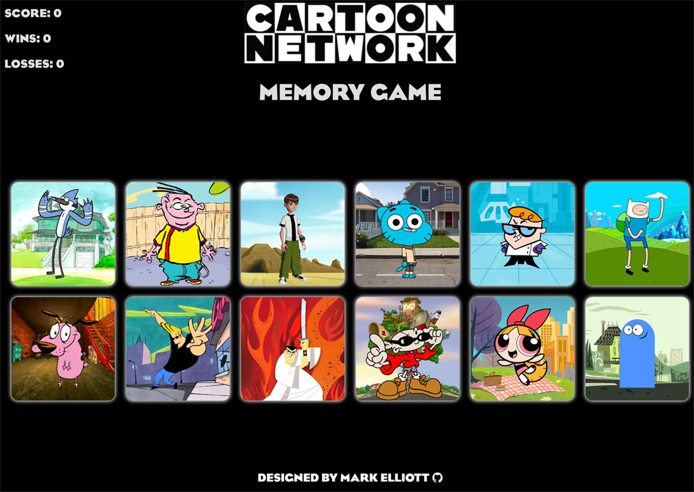

Site is currently deployed [here](https://mark-elliott5-memory-game.netlify.app/).

This Memory game project features:

- Memory game with Cartoon Network characters and font
- React front-end development with PropTypes
- Key generation and assignment with UUID
- Shuffling animation with react-flip-toolkit
- Container perspective tilting on hover with react-parallax-tilt
- Vite
- Netlify deployment

